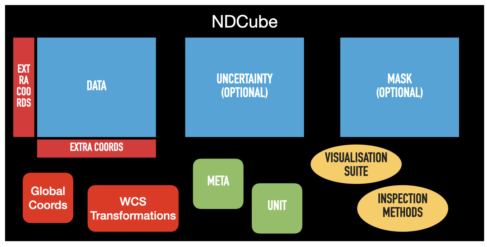

.. _data_classes:

==========
ND Objects
==========

ndcube provides its features via its data objects: `~ndcube.NDCube`, `~ndcube.NDCubeSequence` and `~ndcube.NDCollection`.
This section describes the purpose of each and how they are structured and instantiated.
To learn how to slice, visualize, and perform coordinate transformations with these classes, see the :ref:`slicing`, :ref:`plotting` and :ref:`coordinates` sections.

.. _ndcube:

NDCube
======

`~ndcube.NDCube` is the primary data class the ndcube package.
It's designed to manage a single data array and set of WCS transformations.
`~ndcube.NDCube` provides unified slicing, visualization, coordinate transformation and self-inspection APIs which are independent of the number and physical types of axes.
It can therefore be used for any type of data (e.g. images, spectra, timeseries, etc.) so long as those data are represented by an object that behaves like a `numpy.ndarray` and the coordinates by an object that adheres to the Astropy `WCS API <https://docs.astropy.org/en/stable/wcs/wcsapi.html>`__.
This makes `~ndcube.NDCube` a powerful base class when developing tools for specific data types.

Thanks to its inheritance from `astropy.nddata.NDData`, `~ndcube.NDCube` can hold optional supplementary data in addition to its data array and primary WCS transformations.
These include:
1. general metadata (located at ``.meta``);
2. the unit of the data (an `astropy.units.Unit` or unit `str` located at ``.unit``);
3. the uncertainty of each data value (subclass of `astropy.nddata.NDUncertainty` located at ``.uncertainty``); and a mask marking unreliable data values (boolean array located at ``.mask``). Note that in keeping with the convention of `numpy.ma.masked_array`, ``True`` means that the corresponding data value is masked, i.e. it is bad data, while ``False`` signifies good data.

`~ndcube.NDCube` also provides classes for representing additional coordinates not included in the primary WCS object.
These are `~ndcube.ExtraCoords` (located at ``.extra_coords``) --- for additional coordinates associated with specific array axes --- and `~ndcube.GlobalCoords` (located at ``.global_coords``) for scalar coordinates associated with the `~ndcube.NDCube` as a whole.
These are discussed in the section in this guide on :ref:`coordinates`.

The figure below shows a schematic of an `~ndcube.NDCube` instance and the relationships between its components.
Array-based components are in blue (``.data``, ``.uncertainty``, and ``.mask``), metadata components in green (``.meta`` and ``.unit``), and coordinate components in red (``.wcs``, ``.extra_coords``, and ``.global_coords``).
Yellow ovals represent methods for inspecting, visualizing, and analyzing the `~ndcube.NDCube`.

Initializing an NDCube
----------------------

To initialize the most basic `~ndcube.NDCube` object, we need a `numpy.ndarray`-like array containing the data and a WCS object (e.g. `astropy.wcs.WCS`) describing the coordinate transformations to and from array-elements.
Let's create a 3-D array of data with shape ``(4, 4, 5)`` and a WCS object with axes of wavelength, helioprojective longitude, and helioprojective latitude.
This could represent images of the Sun taken at different wavelengths.
Remember that due to convention, the order of WCS axes is reversed relative to the data array.

.. code-block:: python

  >>> import astropy.wcs
  >>> import numpy as np

  >>> from ndcube import NDCube

  >>> # Define data array.
  >>> data = np.random.rand(4, 4, 5)
  >>> # Define WCS transformations in an astropy WCS object.
  >>> wcs = astropy.wcs.WCS(naxis=3)
  >>> wcs.wcs.ctype = 'WAVE', 'HPLT-TAN', 'HPLN-TAN'
  >>> wcs.wcs.cunit = 'Angstrom', 'deg', 'deg'
  >>> wcs.wcs.cdelt = 0.2, 0.5, 0.4
  >>> wcs.wcs.crpix = 0, 2, 2
  >>> wcs.wcs.crval = 10, 0.5, 1
  >>> wcs.wcs.cname = 'wavelength', 'HPC lat', 'HPC lon'

  >>> # Now instantiate the NDCube
  >>> my_cube = NDCube(data, wcs=wcs)

The data array is stored in ``my_cube.data`` while the WCS object is stored in ``my_cube.wcs``.
The ``.data`` attribute should only be used to access specific raw data values.
When manipulating/slicing the data it is better to slice the `~ndcube.NDCube` instance as a whole so as to ensure that supporting data --- e.g. coordinates, uncertainties, mask --- remain consistent.
(See :ref:`cube_slicing`.)

To instantiate a more complex `~ndcube.NDCube` with metadata, a data unit, uncertainties and a mask, we can do the following:

.. code-block:: python

  >>> import astropy.units as u
  >>> import astropy.wcs
  >>> import numpy as np
  >>> from astropy.nddata import StdDevUncertainty

  >>> from ndcube import NDCube

  >>> # Define data array.
  >>> data = np.random.rand(4, 4, 5)

  >>> # Define WCS transformations in an astropy WCS object.
  >>> wcs = astropy.wcs.WCS(naxis=3)
  >>> wcs.wcs.ctype = 'WAVE', 'HPLT-TAN', 'HPLN-TAN'
  >>> wcs.wcs.cunit = 'Angstrom', 'deg', 'deg'
  >>> wcs.wcs.cdelt = 0.2, 0.5, 0.4
  >>> wcs.wcs.crpix = 0, 2, 2
  >>> wcs.wcs.crval = 10, 0.5, 1
  >>> wcs.wcs.cname = 'wavelength', 'HPC lat', 'HPC lon'

  >>> # Define mask.  Initially set all elements unmasked.
  >>> mask = np.zeros_like(data, dtype=bool)
  >>> mask[0, 0][:] = True  # Now mask some values.
  >>> # Define uncertainty, metadata and unit.
  >>> uncertainty = StdDevUncertainty(np.sqrt(np.abs(data)))
  >>> meta = {"Description": "This is example NDCube metadata."}
  >>> unit = u.ct

  >>> # Instantiate NDCube with supporting data.
  >>> my_cube = NDCube(data, wcs=wcs, uncertainty=uncertainty, mask=mask, meta=meta, unit=unit)

Attaching coordinates in addition to those described by ``NDCube.wcs`` via `~ndcube.ExtraCoords` and `~ndcube.GlobalCoords` is discussed in the :ref:`extra_coords` and :ref:`global_coords` sections.

Dimensions and Physical Types
-----------------------------

`~ndcube.NDCube` has useful properties for inspecting its axes: `~ndcube.NDCube.dimensions` and `~ndcube.NDCube.array_axis_physical_types`.

.. code-block:: python

  >>> my_cube.dimensions
  <Quantity [4., 4., 5.] pix>
  >>> my_cube.array_axis_physical_types
  [('custom:pos.helioprojective.lat', 'custom:pos.helioprojective.lon'),
   ('custom:pos.helioprojective.lat', 'custom:pos.helioprojective.lon'),
   ('em.wl',)]

`~ndcube.NDCube.dimensions` returns a `~astropy.units.Quantity` in pixel units giving the length of each dimension in the `~ndcube.NDCube`.
`~ndcube.NDCube.array_axis_physical_types` returns tuples of strings denoting the types of physical properties represented by each array axis.
The tuples are arranged in array axis order, while the physical types inside each tuple are returned in world order.
As more than one physical type can be associated with an array axis, the length of each tuple can be greater than 1.
This is the case for the 1st and 2nd array array axes which are associated with the coupled world axes of helioprojective latitude and longitude.
The axis names are in generated in accordance with the International Virtual Observatory Alliance (IVOA) `UCD1+ controlled vocabulary <http://www.ivoa.net/documents/REC/UCD/UCDlist-20070402.html>`__.

.. _explode_cube:

Explode NDCube Along Axis
-------------------------

During analysis of some data --- say a of stack of images --- it may be necessary to make some different fine-pointing adjustments to each image that isn't accounted for the in the original WCS translations, e.g. due to satellite wobble.
If these changes are not describable with a single WCS object, it may be desirable to break up the NDCube along a given axis into a sequence of (N-1)DCubes each with their own WCS.
This would enable each WCS to be altered separately.

This is the purpose of the `ndcube.NDCube.explode_along_axis` method.
To explode ``my_cube`` along the last array axis so that we have 5 2-D images, each at a different wavelength, simply call the `~ndcube.NDCube.explode_along_axis` and supply it with the array axis along which the `~ndcube.NDCube` should be exploded.

.. code-block:: python

  >>> exploded = my_cube.explode_along_axis(2)

This returns an `~ndcube.NDCubeSequence` with where the sequence axis acts as the wavelength axis.

.. code-block:: python

  >>> exploded.dimensions
  (<Quantity 5. pix>, <Quantity 4. pix>, <Quantity 4. pix>)
  >>> exploded.array_axis_physical_types
  [('meta.obs.sequence',),
   ('custom:pos.helioprojective.lat', 'custom:pos.helioprojective.lon'),
   ('custom:pos.helioprojective.lat', 'custom:pos.helioprojective.lon')]

To learn more about this object, read the :ref:`ndcubesequence` section below.

And Much More!
--------------

`~ndcube.NDCube` provides many more helpful features, specifically for coordinate transformations, slicing and visualization.
See the :ref:`cube_coordinates`, :ref:`cube_slicing` and :ref:`cube_plotting` sections to learn more.

.. _ndcubesequence:

NDCubeSequence
==============

`~ndcube.NDCubeSequence` is a class for handling multiple `~ndcube.NDCube` objects as if they were one contiguous data set.
The `~ndcube.NDCube` objects within an `~ndcube.NDCubeSequence` must be have the same shape and physical types associated with each axis.
They must also be arranged in some order.
The direction in which the cubes are ordered is referred to as the "sequence axis".
For example, say we have four images of the Sun taken at four different times with the same instrument.
The images have the same array shape but are represented by different sets of WCS transformations with the same number and types are axes.
However, the WCS transformations only describe their celestial coordinates.
Time is not represented.
We can place place each image in its own `~ndcube.NDCube` object but we cannot combine them into a single `~ndcube.NDCube` because we do not have a single 3-D WCS object.
This is where `~ndcube.NDCubeSequence` comes into play.
It allows us to combine the NDCubes into a single object where the sequence axis acts a third dimension representing time.
Thus we can treat the `~ndcube.NDCubeSequence` as if it were a single 3-D data set with an effective shape of ``(4, 512, 512)``.
However under the hood each image remains in its own `~ndcube.NDCube` object.

The above situation is shown in panel a) in the figure below.
The cubes are denoted by blue squares (representing its array-based data) inset with a smaller red square (representing its coordinates and metadata).
The 2-D cubes are stacked in a 3rd dimension labeled "sequence axis" which in the above example represents time.

.. image:: images/ndcubesequence_diagram.png
  :width: 800
  :alt: Schematic of an NDCubeSequence and its two configurations.

However, let's also say that the images represent tiles in a mosaic that, when combined, form a map of the sky much larger than the field of view of the instrument.
Thus the images represent adjacent regions of the sky.
In that case the cubes are not only ordered in time, but also along one of their spatial axes.
Another way of saying this is that the sequence axis is parallel to one of the cubes' axes.
This cube axis is known as the "common axis".
Let's say in our example that the common axis is the 2nd axis.
Thus, we can also treat the data set as if it were a single image with a shape of ``(512, 2048)``.
See panel b) of the figure above.

Setting a common axis is optional and does not force the user to interact with the data as if it were in configuration b).
Instead `~ndcube.NDCubeSequence` has different versions of its methods whose names are prefixed with ``cube_like`` that account for the common axis and equivalent non-cube-like methods that do not.
This allows users to switch back and forth between configurations a) and b) as their use case demands without requiring the user to have two versions of the same data.
This flexibility makes `~ndcube.NDCubeSequence` a powerful tool when handling complex N-D dimensional data described by different but comparable coordinate transformations.

Initializing an NDCubeSequence
------------------------------

To initialize the most basic `~ndcube.NDCubeSequence`, all you need is a list of `~ndcube.NDCube` instances.
Let's say we have four 3-D NDCubes with shapes of ``(4, 4, 5)`` and physical types of helioprojective longitude, latitude and wavelength.

.. expanding-code-block:: python
  :summary: Click to see NDCubes instantiated for use in the following NDCubeSequence

  >>> import astropy.units as u
  >>> import astropy.wcs
  >>> import numpy as np
  >>> from ndcube import NDCube, NDCubeSequence

  >>> # Define data arrays.
  >>> shape = (4, 4, 5)
  >>> data0 = np.random.rand(*shape)
  >>> data1 = np.random.rand(*shape)
  >>> data2 = np.random.rand(*shape)
  >>> data3 = np.random.rand(*shape)

  >>> # Define WCS transformations. Let all cubes have same WCS.
  >>> wcs = astropy.wcs.WCS(naxis=3)
  >>> wcs.wcs.ctype = 'WAVE', 'HPLT-TAN', 'HPLN-TAN'
  >>> wcs.wcs.cunit = 'Angstrom', 'deg', 'deg'
  >>> wcs.wcs.cdelt = 0.2, 0.5, 0.4
  >>> wcs.wcs.crpix = 0, 2, 2
  >>> wcs.wcs.crval = 10, 0.5, 1

  >>> # Instantiate NDCubes.
  >>> cube0 = NDCube(data0, wcs=wcs)
  >>> cube1 = NDCube(data1, wcs=wcs)
  >>> cube2 = NDCube(data2, wcs=wcs)
  >>> cube3 = NDCube(data3, wcs=wcs)

To generate an `~ndcube.NDCubeSequence`, simply provide the list of `~ndcube.NDCube` objects to the `~ndcube.NDCubeSequence` class.

.. code-block:: python

  >>> my_sequence = NDCubeSequence([cube0, cube1, cube2, cube3])

We also have the option of providing some sequence-level metadata.
This is in addition to anything located in the ``.meta`` objects of the NDCubes.

.. code-block:: python

  >>> my_sequence_metadata = {"Description": "This is some sample NDCubeSequence metadata."}
  >>> my_sequence = NDCubeSequence([cube0, cube1, cube2, cube3], meta=my_sequence_metadata)
  >>> my_sequence.meta
  {'Description': 'This is some sample NDCubeSequence metadata.'}

The `~ndcube.NDCube` instances are stored in ``my_sequence.data`` while the metadata is stored at ``my_sequence.meta``.
If we wanted to define a common axis, we must set it during instantiation.
Let's reinstantiate the `~ndcube.NDCubeSequence` with the common axis as the first cube axis.

.. code-block:: python

  >>> my_sequence = NDCubeSequence([cube0, cube1, cube2, cube3], common_axis=0)

.. _dimensions:

Dimensions and Physical Types
-----------------------------

Analogous to `ndcube.NDCube.dimensions`, there is also a `ndcube.NDCubeSequence.dimensions` property for easily inspecting the shape of an `~ndcube.NDCubeSequence` instance.

.. code-block:: python

  >>> my_sequence.dimensions
  (<Quantity 4. pix>, <Quantity 4. pix>, <Quantity 4. pix>, <Quantity 5. pix>)

Slightly differently to `ndcube.NDCube.dimensions`, `ndcube.NDCubeSequence.dimensions` returns a tuple of `astropy.units.Quantity` instances in pixel units, giving the length of each axis.
To see the dimensionality of the sequence in the cube-like paradigm, i.e. taking into account the common axis, use the `ndcube.NDCubeSequence.cube_like_dimensions` property.

.. code-block:: python

  >>> my_sequence.cube_like_dimensions
  <Quantity [16., 4., 5.] pix>

Equivalent to `ndcube.NDCube.array_axis_physical_types`, `ndcube.NDCubeSequence.array_axis_physical_types` returns a list of tuples of physical axis types.
The same `IVOA UCD1+ controlled words <http://www.ivoa.net/documents/REC/UCD/UCDlist-20070402.html>`__ are used for the cube axes.
The sequence axis is given the label ``'meta.obs.sequence'`` as it is the IVOA UCD1+ controlled word that best describes it.
To call, simply do:

.. code-block:: python

  >>> my_sequence.array_axis_physical_types
  [('meta.obs.sequence',),
   ('custom:pos.helioprojective.lat', 'custom:pos.helioprojective.lon'), ('custom:pos.helioprojective.lat', 'custom:pos.helioprojective.lon'),
   ('em.wl',)]

Once again, we can see the physical types associated with each axis in the cube-like paradigm be calling `ndcube.NDCubeSequence.cube_like_array_axis_physical_types`.

.. code-block:: python

  >>> my_sequence.cube_like_array_axis_physical_types
  [('custom:pos.helioprojective.lat', 'custom:pos.helioprojective.lon'),
   ('custom:pos.helioprojective.lat', 'custom:pos.helioprojective.lon'),
   ('em.wl',)]

.. _explode_sequence:

Explode Along Axis
------------------

Just like `~ndcube.NDCube`, `~ndcube.NDCubeSequence` has an `~ndcube.NDCubeSequence.explode_along_axis` method.
Its purpose and API are exactly the same as `ndcube.NDCube.explode_along_axis` and we refer readers to the (:ref:`explode_cube`) section describing it.

To demonstrate the behavior of `ndcube.NDCubeSequence.explode_along_axis` version of this method, let's consider ``my_sequence`` defined above.
It contains four `~ndcube.NDCube` instances, each with a shape of ``(4, 4, 5)`` and physical types of helioprojective longitude, latitude and wavelength.
Let's break up the cubes along the final (wavelength) axis so we have a sequence of 20 2D cubes, each representing a single image with a shape of ``(4, 4)``.
To do this let's call `~ndcube.NDCube.explode_along_axis` and supply it with the array axis along which the cubes should be exploded.
Note that the array axis numbers are relative to the NDCubes, not the NDCubeSequence.
So to explode along the wavelength axis, we should use an array axis index of ``2``.

.. code-block:: python

  >>> exploded_sequence = my_sequence.explode_along_axis(2)

  >>> # Check old and new shapes of the squence
  >>> my_sequence.dimensions
  (<Quantity 4. pix>, <Quantity 4. pix>, <Quantity 4. pix>, <Quantity 5. pix>)
  >>> exploded_sequence.dimensions
  (<Quantity 20. pix>, <Quantity 4. pix>, <Quantity 4. pix>)

Note that an `~ndcube.NDCubeSequence` can be exploded along any axis.
A common axis need not be defined and if one is it need not be the axis along which the `~ndcube.NDCubeSequence` is exploded.

And Much More
-------------

`~ndcube.NDCubeSequence` provides many more helpful features, specifically for coordinate transformations, slicing and visualization.
See the :ref:`sequence_coordinates`, :ref:`sequence_slicing` and :ref:`sequence_plotting` sections to learn more.

.. _ndcollection:

NDCollection
============

`~ndcube.NDCollection` is a container class for grouping `~ndcube.NDCube` or `~ndcube.NDCubeSequence` instances in an unordered way.
`~ndcube.NDCollection` therefore differs from `~ndcube.NDCubeSequence` in that the objects contained are not considered to be in any order, are not assumed to represent measurements of the same physical property, and they can have different dimensionalities.
However `~ndcube.NDCollection` is more powerful than a simple `dict` because it enables us to identify axes that are aligned between the objects and hence provides some limited slicing functionality.
(See :ref:`collection_slicing` to for more on slicing.)

One possible application of `~ndcube.NDCollection` is linking observations with derived data products.
Let's say we have a 3-D `~ndcube.NDCube` representing space-space-wavelength.
Then let's say we fit a spectral line in each pixel's spectrum and extract its linewidth.
Now we have a 2D spatial map of linewidth with the same spatial axes as the original 3-D cube.
There is a clear relationship between these two objects and so it makes sense to store them together.
An `~ndcube.NDCubeSequence` is not appropriate here as the physical properties represented by the two objects is different, they do not have an order within their common coordinate space, and they do not have the same dimensionality.
Instead let's use an `~ndcube.NDCollection`.

Let's use ``my_cube`` defined above as our observations cube and define a "linewidth cube".

.. code-block:: python

  >>> # Define derived linewidth NDCube
  >>> linewidth_data = np.random.rand(4, 4) / 2 # dummy data
  >>> linewidth_wcs = astropy.wcs.WCS(naxis=2)
  >>> linewidth_wcs.wcs.ctype = 'HPLT-TAN', 'HPLN-TAN'
  >>> linewidth_wcs.wcs.cunit = 'deg', 'deg'
  >>> linewidth_wcs.wcs.cdelt = 0.5, 0.4
  >>> linewidth_wcs.wcs.crpix = 2, 2
  >>> linewidth_wcs.wcs.crval = 0.5, 1
  >>> linewidth_cube = NDCube(linewidth_data, linewidth_wcs)

To combine these ND objects into an `~ndcube.NDCollection`, simply supply a sequence of ``(key, value)`` pairs in the same way that you initialize and dictionary.

.. code-block:: python

  >>> from ndcube import NDCollection
  >>> my_collection = NDCollection([("observations", my_cube), ("linewidths", linewidth_cube)])

To access each ND object in ``my_collection`` index it with the name of the desired object, just like a `dict`:

.. code-block:: python

  >>> my_collection["observations"]  # doctest: +SKIP

And just like a `dict` we can see the different names available using the ``keys`` method:

.. code-block:: python

  >>> my_collection.keys()
  dict_keys(['observations', 'linewidths'])

Editing NDCollections
---------------------

Because `~ndcube.NDCollection` inherits from `dict`, we can edit the collection using many of the same methods.
These have the same or analogous APIs to the `dict` versions and include `del`, `~ndcube.NDCollection.pop`, and `~ndcube.NDCollection.update`.
Some `dict` methods may not be implemented on `~ndcube.NDCollection` if they are not consistent with its design.

.. _aligned_axes:

Aligned Axes
------------
In the above example, the linewidth object's axes are aligned with the first two axes of the observations object.
Designating these axes as aligned allows both members of the collection to be simultaneously sliced, thus enabling users to quickly and accurately crop their entire data set to a region of interest.
(For more on this, see :ref:`collection_slicing`.)
There are a few ways to designate aligned axes.
If the members of the collection have the same axis ordering, as is the case in our example, we can provide a single `tuple` of `int`, designating the array axes that are aligned.
(Note that aligned axes must have the same lengths.)

.. code-block:: python

  >>> my_collection = NDCollection([("observations", my_cube), ("linewidths", linewidth_cube)],
  ...                              aligned_axes=(0, 1))

We can see which axes are aligned by inpecting the ``aligned_axes`` attribute:

.. code-block:: python

  >>> my_collection.aligned_axes
  {'observations': (0, 1), 'linewidths': (0, 1)}

This gives us the array axes for each ND object separately.
We should read this as array axis 0 of ``observations`` is aligned with the array axis 0 of ``'linewidths'``, and so on.
However, the mapping can be more complicated.
Let's say we reversed the axes of our ``linewidths`` ND object for some reason:

.. code-block:: python

  >>> linewidth_wcs_reversed = astropy.wcs.WCS(naxis=2)
  >>> linewidth_wcs_reversed.wcs.ctype = 'HPLN-TAN', 'HPLT-TAN'
  >>> linewidth_wcs_reversed.wcs.cunit = 'deg', 'deg'
  >>> linewidth_wcs_reversed.wcs.cdelt = 0.4, 0.5
  >>> linewidth_wcs_reversed.wcs.crpix = 2, 2
  >>> linewidth_wcs_reversed.wcs.crval = 1, 0.5
  >>> linewidth_cube_reversed = NDCube(linewidth_data.transpose(), linewidth_wcs_reversed)

We can still define an `~ndcube.NDCollection` with aligned axes by supplying a tuple of tuples, giving the aligned axes of each ND object separately.

.. code-block:: python

   >>> my_collection_reversed = NDCollection(
   ...    [("observations", my_cube), ("linewidths", linewidth_cube_reversed)],
   ...    aligned_axes=((0, 1), (1, 0)))
   >>> my_collection_reversed.aligned_axes
   {'observations': (0, 1), 'linewidths': (1, 0)}

The first `tuple` corresponds to the ``observations`` and the second `tuple` to ``linewidths``.
Meanwhile the array axes in corresponding positions in the tuples are deemed to be aligned.
So in this case, array axis 0 of ``observations`` is aligned with array axis 1 of ``linewidths`` and array axis 1 of ``observations`` is aligned with array axis 0 of ``linewidths``.

Because aligned axes must have the same lengths, we can get the lengths of the aligned axes by using the ``aligned_dimensions`` property.

.. code-block:: python

  >>> my_collection.aligned_dimensions
  <Quantity [4., 4.] pix>

Note that this only tells us the lengths of the aligned axes.
To see the lengths of the non-aligned axes, e.g. the spectral axis of the ``observations`` object, you must inspect that ND object individually.

We can also see the physical properties to which the aligned axes correspond by using the `~ndcube.NDCollection.aligned_axis_physical_types` property.

.. code-block:: python

  >>> my_collection.aligned_axis_physical_types  # doctest: +SKIP
  [('custom:pos.helioprojective.lon', 'custom:pos.helioprojective.lat'), ('custom:pos.helioprojective.lon', 'custom:pos.helioprojective.lat')]

This returns a `list` of `tuple` in array axis order giving the physical types that correspond to each aligned axis.
For each aligned axis, only physical types associated with all the cubes in the collection are returned.
Note that there is no requirement that all aligned axes must represent the same physical types.
They just have to be the same length.
Therefore, it is possible that this property returns no physical types.
The physical types within each tuple are returned unordered, not in world axis order as might be expected.
This is because there is no requirement that members must have the same axis ordering.

As mentioned at the start of this sub-section, the greatest benefit of `~ndcube.NDCollection.aligned_axes` is that enables all members of an `~ndcube.NDCollection` to be sliced simultaneously, at least along the aligned axes.
This makes it easy to crop an entire data set, including multiple sets of observations and derived products, to a single region of interest.
This can drastically simplify and speed up analysis workflows.
To learn more, see the section on :ref:`collection_slicing`.
