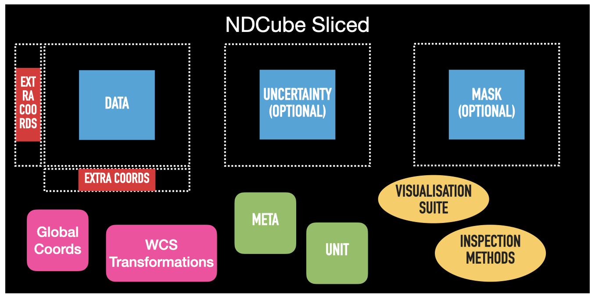
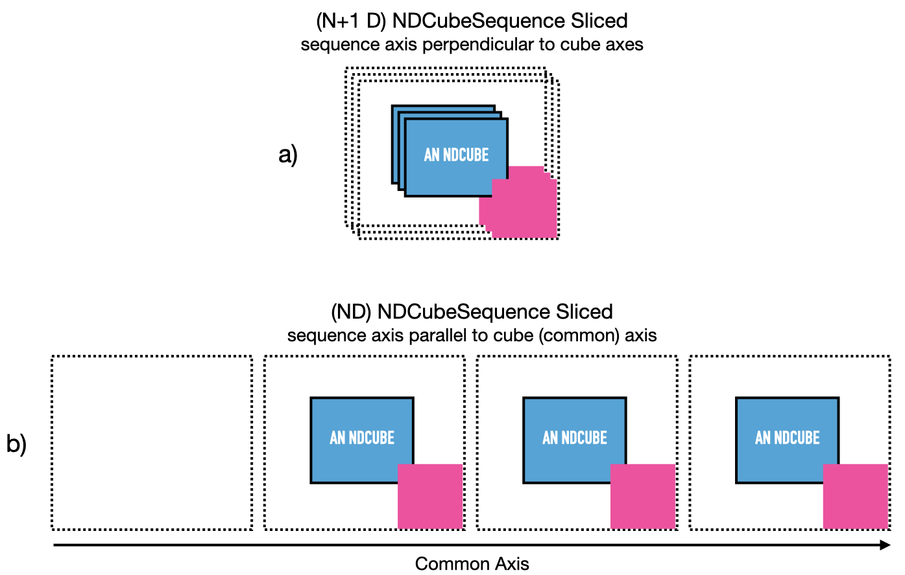

.. _slicing:

==================
Slicing ND Objects
==================

Arguably the most useful feature ndcube provides is the slicing of its data classes.
Users can apply the standard slicing notation to ND objects (or real world coordinates in the case of `ndcube.NDCube.crop`) which alter the data and WCS transformations consistently and simultaneously.
This enables users to rapidly and reliably identify and extract regions of interest in their data, thereby allowing them to move closer to the speed of thought during their analysis.

.. _cube_slicing:

Slicing NDCubes
===============

The `~ndcube.NDCube` slicing infrastructure returns a new `~ndcube.NDCube` with all relevant information consistently altered.
This includes the data, WCS transformations, `~ndcube.ExtraCoords`, uncertainty and mask.
This is achieved by applying the standard slicing API to the `~ndcube.NDCube`.
Because many of the inspection properties such `~ndcube.NDCube.dimensions` and `~ndcube.NDCube.array_axis_physical_types` are calculated on the fly, the information they return after slicing is also consistent with the sliced `~ndcube.NDCube`.
This makes `~ndcube.NDCube`'s slicing infrastructure very powerful.

To slice ``my_cube``, simply do something like:

.. expanding-code-block:: python
  :summary: Expand to see my_cube instantiated.

  >>> import astropy.units as u
  >>> import astropy.wcs
  >>> import numpy as np
  >>> from astropy.nddata import StdDevUncertainty

  >>> from ndcube import NDCube

  >>> # Define data array.
  >>> data = np.random.rand(4, 4, 5)

  >>> # Define WCS transformations in an astropy WCS object.
  >>> wcs = astropy.wcs.WCS(naxis=3)
  >>> wcs.wcs.ctype = 'WAVE', 'HPLT-TAN', 'HPLN-TAN'
  >>> wcs.wcs.cunit = 'Angstrom', 'deg', 'deg'
  >>> wcs.wcs.cdelt = 0.2, 0.5, 0.4
  >>> wcs.wcs.crpix = 0, 2, 2
  >>> wcs.wcs.crval = 10, 0.5, 1

  >>> # Define mask.  Initially set all elements unmasked.
  >>> mask = np.zeros_like(data, dtype=bool)
  >>> mask[0, 0][:] = True  # Now mask some values.
  >>> # Define uncertainty, metadata and unit.
  >>> uncertainty = StdDevUncertainty(np.sqrt(np.abs(data)))
  >>> meta = {"Description": "This is example NDCube metadata."}
  >>> unit = u.ct

  >>> # Instantiate NDCube with supporting data.
  >>> my_cube = NDCube(data, wcs=wcs, uncertainty=uncertainty, mask=mask, meta=meta, unit=unit)

.. code-block:: python

  >>> my_cube_roi = my_cube[1:3, 1:3]

Comparing the figures below demonstrates the consequences of this operation.
The first is the same pictoral representation of an `~ndcube.NDCube` and its components we saw in the :ref:`ndcube` section.
The blue squares represent array-based data, namely ``.data``, ``.uncertainty``, and ``.mask``.
The green squares represent metadata, ``.metadata`` and ``.unit``.
The red squares represent the coordinate objects, ``.wcs``, ``extra_coords``, and ``.global_coords``.
Finally, the yellow ovals represent the inspection and analysis methods of `~ndcube.NDCube`.
For ease of representation, we have only shown two dimensions.

.. image:: images/ndcube_diagram.png
  :width: 800
  :alt: Components of an NDCube before slicing.

The second image shows the same `~ndcube.NDCube` after the above slicing operation has been applied.
The green metadata attributes and yellow methods remain unchanged.
However, the blue arrays have all been consistently altered from their original size, represented by the dotted lines.
The ``.wcs`` and ``.extra_coords`` coordinate objects have also change and are now pink.
This signifies that their transfomations have been altered such that the array elements correspond to the same real world coordinate values as they did in the unsliced `~ndcube.NDCube`.
This is despite the fact that their array indices have been altered because the array sizes have changed.
In this example ``.global_coords`` object is unchanged.
However, ``.global_coords`` is changed when slicing causes an axis to be dropped, e.g.:

.. code-block:: python

  >>> my_2d_cube = my_cube[1:2, 1:3, 0]

This example will create a 2-D `~ndcube.NDCube` where the last (wavelength) dimension is dropped.
As a consequence, wavelength is no longer part of the WCS transformations.
However, the wavelength value at the location where the `~ndcube.NDCube` was sliced can still be accessed via `~ndcube.NDCube.global_coords`.

.. code-block:: python

  >>> my_2d_cube.global_coords['em.wl']  # doctest: +SKIP

This is true for all coordinates, in both the ``.wcs`` and ``.extra_coords`` objects, that no longer correspond to any array axes after slicing.
See the :ref:`global_coords` section for more.

.. _ndcube_crop:

Cropping with Real World Coordinates
------------------------------------

In addition to slicing by index, `~ndcube.NDCube` supports slicing by real world coordinates via the `~ndcube.NDCube.crop` method.
This takes two iterables of high level coordinate objects, e.g. `~astropy.time.Time`, `~astropy.coordinates.SkyCoord`, `~astropy.coordinates.SpectralCoord`, `~astropy,units.Quantity` etc.
Each iterable describes a single location in the data array in real world coordinates.
The first iterable describes the lower corner of the region of interest and thus contains the lower limit of each real world coordinate.
The second iterable represents the upper corner of the region of interest and thus contains the upper limit of each real world coordinate.
The crop method identifies the smallest rectangular region in the data array that contains both the lower and upper limits in all the real world coordinates, and crops the `~ndcube.NDCube` to that region.
It does not rebin or interpolate the data.  The order of the high level coordinate objects in each iterable must be the same as that expected by `astropy.wcs.wcsapi.BaseHighLevelWCS.world_to_array_index`, namely in world order.

.. code-block:: python

  >>> import astropy.units as u
  >>> from astropy.coordinates import SkyCoord, SpectralCoord
  >>> from sunpy.coordinates.frames import Helioprojective
  >>> # Use coordinate objects to mark the lower limit of the region of interest.
  >>> lower_corner = [SpectralCoord(1.04e-9, unit=u.m),
  ...                 SkyCoord(Tx=1, Ty=0.5, unit=u.deg, frame=Helioprojective)]
  >>> upper_corner = [SpectralCoord(1.08e-9, unit=u.m),
  ...                 SkyCoord(Tx=1.5, Ty=1.5, unit=u.deg, frame=Helioprojective)]
  >>> my_cube_roi = my_cube.crop(lower_corner, upper_corner)

.. _sequence_slicing:

Slicing NDCubeSequences
=======================

As with `~ndcube.NDCube`, `~ndcube.NDCubeSequence` is sliced by applying the standard slicing API.
The `~ndcube.NDCubeSequence` slicing infrastructure determines which cubes should be kept based on the sequence axis input, then passes the rest of the slicing off to desired NDCubes.
Thus the data arrays, WCS transformations, masks, uncertainty arrays, and extra coordinates are all altered accordingly in each relevant sub-cube.

Just as we did in the :ref:`ndcubesequence` section, let's represent this `~ndcube.NDCubeSequence` pictorially in the figure below.
Each `~ndcube.NDCube` is represented by a blue square inset with a smaller red one.
The blue square represents its array-based data while the red square represents its coordinate and metadata.
Panel a) shows the sequence in its default configuration, with the sequence axis acting as an axis perpendicular and in addition to the cube axes.
However let's say we defined ``common_axis=0`` above.
In that case we can also think of the cubes as arrange sequentially along that axis, as represented in panel b).
For ease of representation we have not shown the 3rd axis of the cubes.

.. image:: images/ndcubesequence_diagram.png
  :width: 800
  :alt: Schematic of an NDCubeSequence before slicing.

Say we have four NDCubes in an `~ndcube.NDCubeSequence`, each of shape ``(4, 4, 5)``.
Now suppose we want to obtain a region of interest from the 2nd, 3rd, and 4th cubes in the sequence.
Let the region of interest in each cube be defined as between the 2nd and 3rd pixels (inclusive) in all cube dimensions.
This would be a cumbersome slicing operation if treating the sub-cubes independently.
(This would be made even worse without the power of `~ndcube.NDCube` where the data arrays, WCS objects, masks, uncertainty arrays, etc. would all have to be sliced independently!)
However, with `~ndcube.NDCubeSequence` this becomes as simple as indexing a single array.

.. expanding-code-block:: python
  :summary: Click to reveal/hide the instantiation of the NDCubeSequence.

  >>> import astropy.units as u
  >>> import astropy.wcs
  >>> import numpy as np
  >>> from ndcube import NDCube, NDCubeSequence

  >>> # Define data arrays.
  >>> shape = (4, 4, 5)
  >>> data0 = np.random.rand(*shape)
  >>> data1 = np.random.rand(*shape)
  >>> data2 = np.random.rand(*shape)
  >>> data3 = np.random.rand(*shape)

  >>> # Define WCS transformations. Let all cubes have same WCS.
  >>> wcs = astropy.wcs.WCS(naxis=3)
  >>> wcs.wcs.ctype = 'WAVE', 'HPLT-TAN', 'HPLN-TAN'
  >>> wcs.wcs.cunit = 'Angstrom', 'deg', 'deg'
  >>> wcs.wcs.cdelt = 0.2, 0.5, 0.4
  >>> wcs.wcs.crpix = 0, 2, 2
  >>> wcs.wcs.crval = 10, 0.5, 1

  >>> # Instantiate NDCubes.
  >>> cube0 = NDCube(data0, wcs=wcs)
  >>> cube1 = NDCube(data1, wcs=wcs)
  >>> cube2 = NDCube(data2, wcs=wcs)
  >>> cube3 = NDCube(data3, wcs=wcs)

  >>> # Instantiate NDCubeSequence. Let the common axis be 0.
  >>> my_sequence = NDCubeSequence([cube0, cube1, cube2, cube3], common_axis=0)

.. code-block:: python

  >>> my_sequence_roi = my_sequence[1:4, 1:3, 1:3, 1:3]

The result of this operation is shown in the next figure.
The new `~ndcube.NDCubeSequence` contains only three cubes.
The 1st cube in the original sequence was dropped.
The arrays (blue) in each cube have been sliced and the coordinate objects (red/pink) have been altered accordingly.

We can confirm the dimensionality and physical types of the new sequence by checking the ``.dimensions`` and ``.array_axis_physical_types`` properties.

.. code-block:: python

  >>> my_sequence_roi.dimensions
  (<Quantity 3. pix>, <Quantity 2. pix>, <Quantity 2. pix>, <Quantity 2. pix>)
  >>> my_sequence_roi.array_axis_physical_types
  [('meta.obs.sequence',), ('custom:pos.helioprojective.lat', 'custom:pos.helioprojective.lon'), ('custom:pos.helioprojective.lat', 'custom:pos.helioprojective.lon'), ('em.wl',)]

If we want our region of interest to only apply to a single sub-cube, and we index the sequence axis with an `int`, an `~ndcube.NDCube` is returned.

.. code-block:: python

  >>> single_cube_roi = my_sequence[1, 0, 1:3, 1:4]
  >>> single_cube_roi.dimensions
  <Quantity [2., 3.] pix>
  >>> single_cube_roi.array_axis_physical_types
  [('custom:pos.helioprojective.lat', 'custom:pos.helioprojective.lon'),
   ('em.wl',)]

However, as with numpy slicing, we can induce the slicing operation to return an `~ndcube.NDCubeSequence` by supplying a length-1 `slice` to the sequence axis, rather than an `int`.
This sequence will still represent the same region of interest from the same single sub-cube, but the sequence axis will have a length of 1, rather than be removed.

.. code-block:: python

  >>> roi_length1_sequence = my_sequence[0:1, 0, 1:3, 1:4]
  >>> roi_length1_sequence.dimensions
  (<Quantity 1. pix>, <Quantity 2. pix>, <Quantity 3. pix>)
  >>> roi_length1_sequence.array_axis_physical_types
  [('meta.obs.sequence',),
   ('custom:pos.helioprojective.lat', 'custom:pos.helioprojective.lon'),
   ('em.wl',)]

Cube-like Slicing
-----------------

As explained in the :ref:`ndcubesequence` section, we can think of the cubes in an `~ndcube.NDCubeSequence` as being concatenated along one of the cubes' axes if we set a common axis.
See panel b) of the above NDCubeSequence figures.
Therefore it would be useful to be able to slice the sequence as though it were one large concatenated cube.
This can be achieved with the `ndcube.NDCubeSequence.index_as_cube` property.
Note that if a common axis is set, we do not have to slice this way.
Instead, we simply have the option of using regular slicing or `ndcube.NDCubeSequence.index_as_cube`.

In the above example, we set the common axis to ``0``.
Recall that, ``my_sequence`` has a shape of ``(<Quantity 4. pix>, <Quantity 4. pix>, <Quantity 4. pix>, <Quantity 5. pix>)``.
Therefore it has ``cube-like`` dimensions of ``(<Quantity 16. pix>, <Quantity 4. pix>, <Quantity 5. pix>)`` where the first sub-cube extends along the 0th cube-like axis from 0 to 4, the second from 4 to 8 and the third from 8 to 12, and the fourth from 12 to 16.

.. code-block:: python

  >>> my_sequence.cube_like_dimensions
  <Quantity [16., 4., 5.] pix>

Now say we want to extract the same region of interest as above, i.e. ``my_sequence[1, 0, 1:3, 1:4]``.
This can be achieved by entering:

.. code-block:: python

  >>> single_cube_roi = my_sequence.index_as_cube[4, 1:3, 1:4]
  >>> single_cube_roi.dimensions
  <Quantity [2., 3.] pix>
  >>> single_cube_roi.array_axis_physical_types
  [('custom:pos.helioprojective.lat', 'custom:pos.helioprojective.lon'),
   ('em.wl',)]

This returns the same `~ndcube.NDCube` as above.
However, also as above, we can induce the return type to be an `~ndcube.NDCubeSequence` by supplying a length-1 `slice`.
As before, the same region of interest from the same sub-cube is represeted, just with sequence and common axes of length 1.

.. code-block:: python

  >>> roi_length1_sequence = my_sequence.index_as_cube[4:5, 1:3, 1:4]
  >>> roi_length1_sequence.dimensions
  (<Quantity 1. pix>, <Quantity 1. pix>, <Quantity 2. pix>, <Quantity 3. pix>)
  >>> roi_length1_sequence.array_axis_physical_types
  [('meta.obs.sequence',),
   ('custom:pos.helioprojective.lat', 'custom:pos.helioprojective.lon'),
   ('custom:pos.helioprojective.lat', 'custom:pos.helioprojective.lon'),
   ('em.wl',)]

In the case the entire region came from a single sub-cube.
However, `~ndcube.NDCubeSequence.index_as_cube` also works when the region of interest spans multiple sub-cubes in the sequence.
Say we want the same region of interest in the 2nd and 3rd cube dimensions, but this time from the final slice along the 1st cube axis of the 1st sub-cube the whole 2nd sub-cube and the 1st slice of the 3rd sub-cube.
In cube-like indexing this corresponds to slices 3 to 9 along to their 1st cube axis.

.. code-block:: python

  >>> roi_across_cubes = my_sequence.index_as_cube[3:9, 1:3, 1:4]
  >>> roi_across_cubes.dimensions
  (<Quantity 3. pix>,
   <Quantity [1., 4., 1.] pix>,
   <Quantity 2. pix>,
   <Quantity 3. pix>)
  >>> roi_across_cubes.array_axis_physical_types
  [('meta.obs.sequence',),
   ('custom:pos.helioprojective.lat', 'custom:pos.helioprojective.lon'),
   ('custom:pos.helioprojective.lat', 'custom:pos.helioprojective.lon'),
   ('em.wl',)]

Notice that since the sub-cubes are now of different lengths along the common axis, the corresponding `~astropy.units.Quantity` gives the
lengths of each cube individually.

.. _collection_slicing:

Slicing NDCollections
=====================

Recall from the :ref:`ndcollection` section that members of an `~ndcube.NDCollection` can be accessed by slicing it with a string giving the member's name.

.. code-block:: python

  >>> my_collection['observations']  # doctest: +SKIP

However, also recall that we can mark axes of the member ND objects that are aligned.
The value in this is that it enables users to slice all the members of the collection simultaneously from the `~ndcube.NDCollection` level.
This can only be done for aligned axes.
Non-aligned axes must be sliced separately.
Nonetheless, `~ndcube.NDCollection`'s slicing capability represents one of its greatest advantages over a simple Python `dict`, making it a powerful tool for rapidly and reliably cropping multiple components of a data set to a region of interest.
This has the potential to drastically speed up analysis workflows.

To demonstrate, let's instantiate an `~ndcube.NDCollection` with aligned axes, as we did in the :ref:`ndcollection` section.

.. expanding-code-block:: python
  :summary: Click to reveal/hide the instantiation of the 'linewidths' cube.  We'll use "my_cube" defined above for the 'observations' cube.

  >>> # Define derived linewidth NDCube
  >>> linewidth_data = np.random.rand(4, 4) / 2 # dummy data
  >>> linewidth_wcs = astropy.wcs.WCS(naxis=2)
  >>> linewidth_wcs.wcs.ctype = 'HPLT-TAN', 'HPLN-TAN'
  >>> linewidth_wcs.wcs.cunit = 'deg', 'deg'
  >>> linewidth_wcs.wcs.cdelt = 0.5, 0.4
  >>> linewidth_wcs.wcs.crpix = 2, 2
  >>> linewidth_wcs.wcs.crval = 0.5, 1
  >>> linewidth_cube = NDCube(linewidth_data, linewidth_wcs)

.. code-block:: python

  >>> from ndcube import NDCollection
  >>> my_collection = NDCollection([("observations", my_cube), ("linewidths", linewidth_cube)],
  ...                              aligned_axes=(0, 1))

To slice the `~ndcube.NDCollection` you can simply do the following:

.. code-block:: python

  >>> sliced_collection = my_collection[1:3, 3:8]

Note that we still have the same number of ND objects, but both have been sliced using the inputs provided by the user.
The slicing takes account of and updates the aligned axis information.
Thus a self-consistent result is obtained.

.. code-block:: python

  >>> sliced_collection.keys()
  dict_keys(['observations', 'linewidths'])
  >>> sliced_collection.aligned_dimensions
  <Quantity [2.0, 1.0] pix>

This is true even if the aligned axes are not in order.
Let's say we axis order of the ``linewidths`` cube was reversed.

.. code-block:: python

  >>> linewidth_wcs_reversed = astropy.wcs.WCS(naxis=2)
  >>> linewidth_wcs_reversed.wcs.ctype = 'HPLN-TAN', 'HPLT-TAN'
  >>> linewidth_wcs_reversed.wcs.cunit = 'deg', 'deg'
  >>> linewidth_wcs_reversed.wcs.cdelt = 0.4, 0.5
  >>> linewidth_wcs_reversed.wcs.crpix = 2, 2
  >>> linewidth_wcs_reversed.wcs.crval = 1, 0.5
  >>> linewidth_cube_reversed = NDCube(linewidth_data.transpose(), linewidth_wcs_reversed)

  >>> my_collection_reversed = NDCollection([("observations", my_cube),
  ...                                        ("linewidths", linewidth_cube_reversed)],
  ...                                       aligned_axes=((0, 1), (1, 0)))

  >>> sliced_collection_reversed = my_collection_reversed[1:3, 3:8]
  >>> sliced_collection_reversed.keys()
  dict_keys(['observations', 'linewidths'])
  >>> sliced_collection_reversed.aligned_dimensions
  <Quantity [2.0, 1.0] pix>

The same result is obtained.
