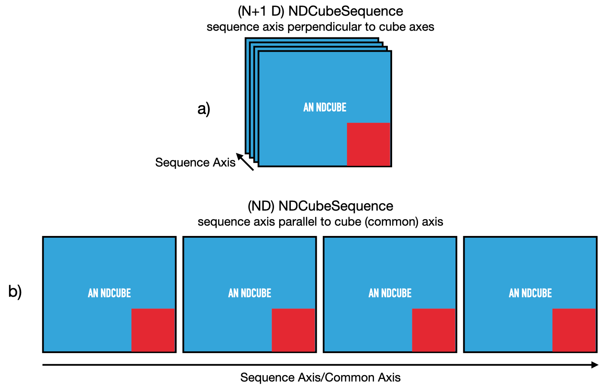

# Summary

ndcube is a free, open-source, community-developed Python package whose purpose
is to faciliate the manipulation and visualization of astronomical data.
It does this by linking the data and coordinates in single data objects.
These objects can be manipulated via array-like slicing operations which modify
the data and coordinates simultaneously.
They also allow coordinate transformations to be performed with reference to the
shape of the data and enable coordinate-aware visualizations.
This data-coordinate coupling allows users to analyze their data more
easily and accurately, thus helping to boost their scientific output.

ndcube is agnostic to the physical properties represented by the data values and axes.
This makes it a powerful base upon which to build tools for specific types of data.
This might be a specific number and/or combination of physical types
(spectrograms, image cubes, etc.), or data from specific instruments or simulations.
Thus, ndcube can also enhance the productivity of developers by centralizing the
development and maintenance of the most useful and general functionalities.
This leaves more time for developing a greater range of tools for the community
and/or enables part-time developers to devote more effort to other aspects of their jobs,
e.g. scientific analysis.

A network benefit of ndcube is that it standardizes the APIs for handling N-D data.
Broad adoption throughout astronomy and heliophysics would help scientists to more easily
work with data from different sub-fields.
This can help facilitate synergies between new combinations of data,
foster inter-field collaborations, and promote scientific innovation.

# Statement of Need

N-dimensional data sets are common in all areas of science and beyond.
For example, a series of images taken sequentially with a CCD camera can be stored
as a single 3-D array with two spatial axes and one temporal axis.
The value in each array-element can represent the reading in a pixel at a given time.
In astronomy, the relationship between the array element and the location and time
in the Universe being observed is often represented by the World Coordinate System (WCS) framework.
WCS’s ability to handle many different physical types (e.g. spatial, temporal, spectral, etc.)
and projections (e.g. RA and Dec., helioprojective latitude and longitude, etc.)
make it a succinct, standardized and powerful way to relate array axes to the physical
properties they represent.
Due of the prevalence of N-D data and the importance of coordinate transformations,
there exist mature Python packages for handling them.
However, they are not suited to treating data and coordinates in a combined way.
This is the purpose of ndcube.

The fundamental reason to opt for ndcube over its most similar package, xarray,
is to harness the astronomy-specific World Coordinate System (WCS).
The data model of xarray centers on the requirements and conventions of the geosciences.
Although similar to those of astronomy in conception, they are sufficiently different
in construction to cause significant friction.
Moreover, utilizing the astropy WCS infrastructure enables us to directly read the most
common file format in astronomy, FITS.

# Data Objects: The Pillars of ndcube

At the time of writing (ndcube v2.0), ndcube provides three primary data objects for
manipulating astronomical data: NDCube, NDCubeSequence, and NDCollection.
Each provide unified slicing, visualization, coordinate transformation and
self-inspection APIs which are independent of the number and physical types of axes.

NDCube is the primary data class the ndcube package.
It’s designed to manage a single data array and set of WCS transformations.
The data array can be of any type that acts like a numpy ndarray [REFERENCE]
and the WCS object can be of any type that adheres to the Astropy WCS API [REFERENCE].
NDCube can hold optional supplementary data including general metadata, a data unit,
uncertainties, and a data mask.
See Figure \autoref{fig:ndcube}.
NDCube also provides support for tabular coordinates in addition to those stored in the
the primary WCS object via its ExtraCoords class.
Scalar coordinates that apply to the whole cube and not associated with specific axis/axes,
e.g. the timestamp of a 2-D image, can be represented via the GlobalCoords class.
Instances of both these classes can be attached to an NDCube instance and self-consistently
handled by the slicing and visualization infrastructures.

![The effects of slicing -- e.g. via ``my_cube[2:4, 8:16]`` -- on the components of an NDCube.\label{fig:ndcube_sliced}](ndcube_sliced_diagram.png)

Figure \autoref{fig:ndcube_sliced} demonstrates the power of NDCube by showing what happens
when the standard Python slicing API is applied to an NDCube, e.g. ``my_cube[2:4, 8:16]``.
Note that this single line of code simultaneously alters the shapes of the array-based
components (blue squares) in accordance with the input slice item.
The coordinate components (red/pink boxes) have been modified to ensure the same "pixels"
correspond to the same real world coordinate values, even though their array indices
have been altered by the slicing operation.
Manually slicing and tracking these components is a tedious process that is prone to mistakes.
By contrast NDCube makes this process effortless and reliable.

NDCubeSequence handles an ordered list of NDCubes with the same data shape and
axis physical types.
They can be ordered along one of their axes, e.g. a sequence of images in a horizontal
mosaic of the sky, or independent of the axes, e.g. a chronological sequence of
2-D images of the same region.
NDCubeSequence is most useful when it not possible to represent an axis is a single
set of WCS transformations.
Yet its slicing, coordinate transformation and visualization functionalities
are designed to enable the user, as much as possible, to interact with the data as if
it were a single NDCube.

NDCollection is a class for grouping NDCubes or NDCubeSequences.
It differs from NDCubeSequence in that the objects contained are not ordered,
are not assumed to represent measurements of the same physical property,
and can have different dimensionalities.
One application of NDCollection is linking observations with derived data products.
Consider a 3-D spectral image cube and a 2-D doppler velocity map derived
by fitting a spectral line in each pixel.
These objects are clearly related.
They share the same spatial axes.
But they have different dimensionalities (3-D and 2-D), represent different physical
properties (flux and velocity) and don't have an order in their common coordinate space.
They are therefore well-suited to being stored in an NDCollection.
Each each cube is referenced by its name, making NDCollection similar to a Python dictionary.
However it also enables axes to be marked as "aligned" which facilitates
simultaneous slicing of the collection's components along those aligned axes.
In the above example, we could mark the spatial axes of the spectral image cube and
doppler map as "aligned" and then extract a spatial sub-region by slicing the NDCollection
rather than the two data objects separately.
Thus NDCollection also enables easier and more reliable manipulation of N-D astronomical
data sets.

# Citations

Citations to entries in paper.bib should be in
[rMarkdown](http://rmarkdown.rstudio.com/authoring_bibliographies_and_citations.html)
format.

If you want to cite a software repository URL (e.g. something on GitHub without a preferred
citation) then you can do it with the example BibTeX entry below for @fidgit.

For a quick reference, the following citation commands can be used:
- `@author:2001`  ->  "Author et al. (2001)"
- `[@author:2001]` -> "(Author et al., 2001)"
- `[@author1:2001; @author2:2001]` -> "(Author1 et al., 2001; Author2 et al., 2002)"

# Acknowledgements

We acknowledge support for ndcube from NASA's Heliophysics Data Environment Enhancement
program and the Daniel K. Inouye Solar Telescope.
We also acknowledge the SunPy and Python in Heliophysics communities for their support.

# References

